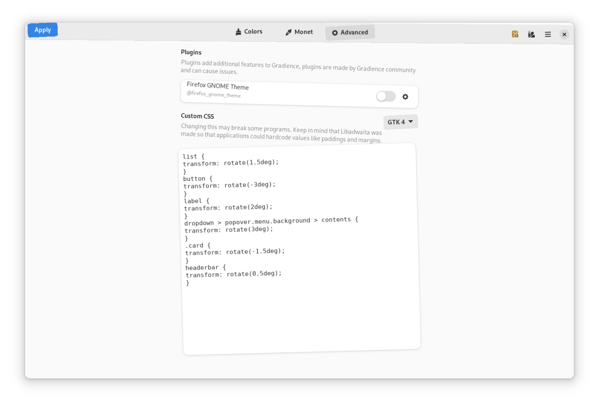

### enjoy some hideous themes
make your eyeballs regret ever laying eyes upon your applications with these gloriously hideous css styles!

  
<b>Unpleasant Gradient</b>

   
  
  
   
  *this unpleasant gradient shows up to your door*
  
 

  
<b>OOPS!</b>

   
  
  
   
  *whoops! all my widgets have been knocked out of place!*
  
  

  
<b>Hot Dog Stand</b>

   
  
  
   
  *the classic ugly theme we all know and love*
  
  

